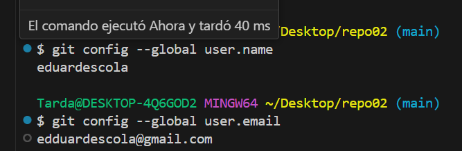

# Proyecto: Mi Nuevo Repositorio

Este documento describe los pasos para trabajar con un repositorio clonado desde GitHub, añadiendo archivos y realizando un commit inicial.


## 1. Verificar la Configuración de Git

Si ya tienes tu usuario y correo configurados globalmente, puedes omitir este paso. Para verificarlo, usa:

```bash
git config --global user.name
```

```bash
git config --global user.email
```


Si necesitas configurarlo, usa:

```bash
git config --global user.name "Tu Nombre"
git config --global user.email "tuemail@example.com"
```

## 2. Crear Archivos en el Repositorio

Dado que el repositorio está clonado y vacío, crea un archivo README y otros archivos si es necesario:

## 3. Añadir los Archivos al Repositorio

Para agregar los archivos creados o modificados al área de preparación:

```bash
git add .
```


## 4. Realizar el Primer Commit

Ejecuta el siguiente comando para confirmar los cambios:

```bash
git commit -m "Primer commit: Añadido README.md"
```


## 5. Subir los Cambios al Repositorio Remoto

Para enviar los cambios al repositorio en GitHub:

```bash
git push origin main
```


## 6. Verificar que los Cambios se Subieron Correctamente

Puedes comprobar los cambios en GitHub visitando el repositorio en tu navegador o ejecutando:

```bash
git log --oneline
```


---

¡Listo! Ahora puedes seguir trabajando en tu proyecto y realizar más commits según sea necesario.
